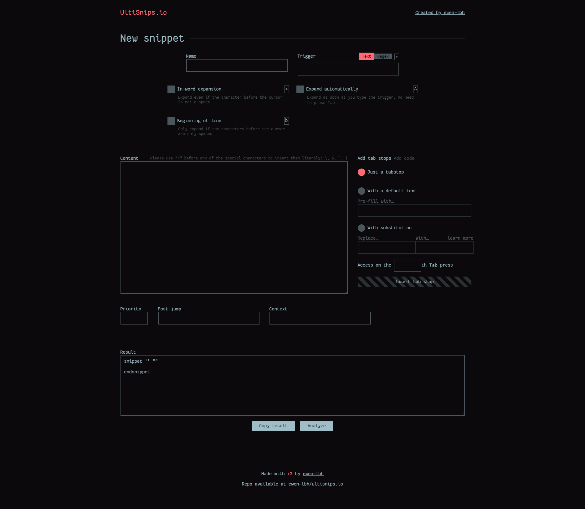

# ultisnips-tool
Provides the following tools for [ultisnips snippets](https://github.com/SirVer/ultisnips):

_(unchecked means not done yet)_
- [x] Snippet generation
- [x] Snippet analysis
- [ ] Snippet conflicts checker

## Tech stack used

Made without any framework, using preprocessors:

- pug → html
- stylus → css
- livescript → js

## UI Prototype

Available [on Figma](https://www.figma.com/proto/vS1qgbKknEOIoCm8aom7oh/ultisnips.io?node-id=1%3A2&scaling=min-zoom)

## Screenshot

